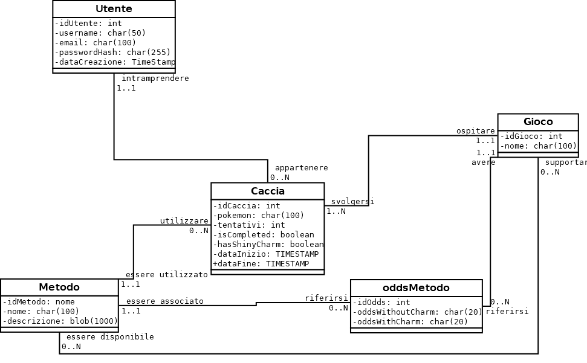

# SIVACACCIA

SIVACACCIA è un'applicazione web per tenere traccia delle tue cacce ai Pokémon shiny. Gestisci contatori, visualizza la tua collezione e condividi i tuoi progressi nella community.

## Cos'è uno Shiny Tracker?

Uno **Shiny Tracker** è uno strumento di supporto pensato per aiutare i giocatori dei giochi Pokémon ufficiali a organizzare e monitorare le loro cacce ai Pokémon shiny — versioni rare e cromaticamente diverse dei Pokémon, estremamente difficili da ottenere.

## A cosa serve?

**SIVACACCIA non è un gioco**: è un supporto che ti accompagna mentre giochi ai titoli Pokémon sulla tua console (come Nintendo Switch, 3DS, ecc.). Serve a:

- Contare i tentativi mentre cerchi uno shiny
- Annotare i dettagli di ogni caccia: Pokémon, gioco, metodo di caccia
- Tenere ordinata la tua collezione di shiny catturati
- Visualizzare statistiche e probabilità dei diversi metodi shiny
- Confrontare i tuoi risultati con quelli di altri utenti nella community

## Perché è utile?

La caccia agli shiny può richiedere **centinaia o migliaia di tentativi**, e ricordarsi tutto a mente è praticamente impossibile. SIVACACCIA ti aiuta a:

- Non perdere il conto
- Avere una panoramica chiara delle tue cacce attive e completate
- Rendere ogni caccia più motivante grazie alla progressione visiva
- Condividere i tuoi risultati e confrontarti con altri appassionati

## Funzionalità

- **Dashboard Interattiva**: Contatori per ogni caccia con aggiornamento in tempo reale e supporto per incremento automatico
- **Collezione**: Visualizza i Pokémon shiny che hai catturato e filtra per gioco o metodo
- **Metodi di Caccia**: Informazioni dettagliate sui diversi metodi per trovare Pokémon shiny per ogni gioco
- **Classifica**: Confronta i tuoi progressi con altri utenti in diverse categorie
- **Account Utente**: Gestione completa dell'account con possibilità di modificare username e password
- **Interfaccia Responsive**: Design adattabile a diverse dimensioni di schermo
- **Tema Chiaro/Scuro**: Modalità di visualizzazione adattabili alle preferenze dell'utente

## Requisiti

- XAMPP con PHP 7.0+ e MySQL/MariaDB
- Browser web moderno con supporto JavaScript

## Installazione

1. Clona o scarica questa repository
2. Copia l'intera cartella nella directory `htdocs` di XAMPP
3. Avvia i servizi Apache e MySQL di XAMPP
4. Accedi a PhpMyAdmin (http://localhost/phpmyadmin)
5. Importa il file `database_setup.sql` per creare il database e le tabelle necessarie
6. Accedi all'applicazione visitando http://localhost/ShinyTracker/

### Configurazione del Database

Modifica il file `config.php` con i tuoi dati di connessione al database se necessario:

```php
<?php
$servername = "localhost";
$username = "root";
$password = "";
$dbname = "shiny_tracker";

$conn = new mysqli($servername, $username, $password, $dbname);

?>
```

## Utilizzo

1. Registra un account dalla pagina di login
2. Accedi con le tue credenziali
3. Nella dashboard, crea nuove cacce specificando il Pokémon, il gioco e il metodo
4. Utilizza i pulsanti per incrementare il contatore durante la caccia:
   - Incremento manuale con il pulsante "+"
   - Incremento automatico con il pulsante di auto-sync
5. Segna la caccia come completata quando trovi uno shiny
6. Visualizza la tua collezione nella sezione "Collezione"
7. Consulta la classifica per confrontare i tuoi progressi con altri utenti
8. Gestisci il tuo account attraverso il menu utente

## Struttura dell'Applicazione

### File Principali
- `index.php`: Dashboard principale con cacce attive
- `collection.php`: Visualizzazione della collezione di shiny
- `methods.php`: Informazioni sui metodi di caccia
- `leaderboard.php`: Classifica degli utenti
- `user_account.php`: Gestione dell'account utente
- `Login.php` e `register.php`: Autenticazione utente
- `logout.php`: Disconnessione
- `get_leaderboard.php`: API per i dati della classifica
- `config.php`: Configurazione connessione database
- `database_setup.sql`: Script di installazione del database

### Struttura del Database

- `tblUtenti`: Informazioni sugli utenti
- `tblGiochi`: Elenco dei giochi Pokémon
- `tblMetodi`: Metodi di caccia shiny
- `tblGiochiMetodi`: Relazione molti-a-molti tra giochi e metodi
- `tblCacce`: Dettagli sulle cacce degli utenti
- `tblPokemon`: Elenco dei Pokémon disponibili

## Schema Concettuale del Database

Il database di SIVACACCIA è progettato con un modello relazionale che supporta tutte le funzionalità dell'applicazione. Di seguito è descritto lo schema concettuale con le relazioni tra le entità e le regole di lettura.



### Entità e Relazioni

1. **Utenti** (`tblUtenti`)
   - Ogni utente ha un identificatore univoco (`idUtente`)
   - Attributi: username, email, passwordHash, dataCreazione

2. **Giochi** (`tblGiochi`)
   - Ogni gioco ha un identificatore univoco (`idGioco`)
   - Attributi: nome

3. **Metodi** (`tblMetodi`)
   - Ogni metodo ha un identificatore univoco (`idMetodo`)
   - Attributi: nome, descrizione

4. **Giochi-Metodi** (`tblGiochiMetodi`)
   - Rappresenta la relazione molti-a-molti tra giochi e metodi
   - Ogni metodo può essere disponibile in più giochi e ogni gioco può avere più metodi

5. **Cacce** (`tblCacce`)
   - Ogni caccia ha un identificatore univoco (`idCaccia`)
   - Attributi: pokemon, tentativi, isCompleted, hasShinyCharm, DataInizio, DataFine
   - Relazioni con: Utenti, Giochi, Metodi

6. **Probabilità dei Metodi** (`tblOddsMetodi`)
   - Contiene le probabilità di trovare shiny per ogni combinazione di metodo e gioco
   - Attributi: oddsWithoutCharm, oddsWithCharm
   - Relazioni con: Metodi, Giochi

### Regole di Lettura e Cardinalità

1. **Utente → Cacce**:
   - Cardinalità: Utente [1..1] --- [0..N] Cacce
   - Regola di lettura: "Ogni utente può intraprendere una o più cacce; ogni caccia deve appartenere a un solo utente"

2. **Gioco → Cacce**:
   - Cardinalità: Gioco [1..1] --- [0..N] Cacce
   - Regola di lettura: "Ogni gioco può ospitare una o più cacce; ogni caccia deve svolgersi in un solo gioco"

3. **Metodo → Cacce**:
   - Cardinalità: Metodo [1..1] --- [0..N] Cacce
   - Regola di lettura: "Ogni metodo può essere utilizzato in una o più cacce; ogni caccia deve utilizzare un solo metodo"

4. **Gioco ↔ Metodo**:
   - Cardinalità: Gioco [0..N] --- [0..M] Metodo
   - Regola di lettura: "Ogni gioco può supportare una o più metodi; ogni metodo può essere disponibile in una o più giochi"

5. **Gioco ↔ OddsMetodo**:
   - Cardinalità: Gioco [1..1] — [0..N] OddsMetodo
   - Regola di lettura: "Ogni gioco può avere una o più voci di probabilità (odds); ogni odds deve riferirsi a un solo gioco."
6. **Metodo ↔ OddsMetodo**:
   - Cardinalità: Metodo [1..1] — [0..N] OddsMetodo
   - Regola di lettura: "Ogni metodo può essere associato a una o più voci di probabilità; ogni odds deve riferirsi a un solo metodo."

### Vincoli di Integrità

- **Integrità Referenziale**:
  - Quando un utente viene eliminato, tutte le sue cacce vengono eliminate a cascata
  - Le combinazioni gioco-metodo rispettano l'esistenza di entrambi gli elementi
  - Le probabilità dei metodi sono associate solo a combinazioni valide di giochi e metodi

- **Vincoli sui Dati**:
  - Username e email degli utenti sono unici
  - I nomi dei giochi e dei metodi sono unici
  - I contatori delle cacce non possono essere negativi


## Tecnologie Utilizzate

- PHP 7+ per il backend
- MySQL/MariaDB per il database
- JavaScript con jQuery per le interazioni client-side
- AJAX per aggiornamenti in tempo reale
- Bootstrap 4 per l'interfaccia utente responsive
- PokéAPI per i dati sui Pokémon
- FontAwesome per le icone

## Sviluppi Futuri

- Implementazione di avatar personalizzati per gli utenti
- Sistema di commenti e condivisione delle cacce
- Statistiche più dettagliate per metodo e gioco
- Implementare la funzione trulimero trulicina
- Supporto per più lingue
- Esportazione della collezione
- Aggiungere tutti gli odds per ogni per tutti i metodi

## Licenza

Questo progetto è rilasciato sotto licenza SKIBIDIBI. Vedere il file LICENSE per i dettagli.(non perdere tempo a cercarlo che tanto non esiste) 